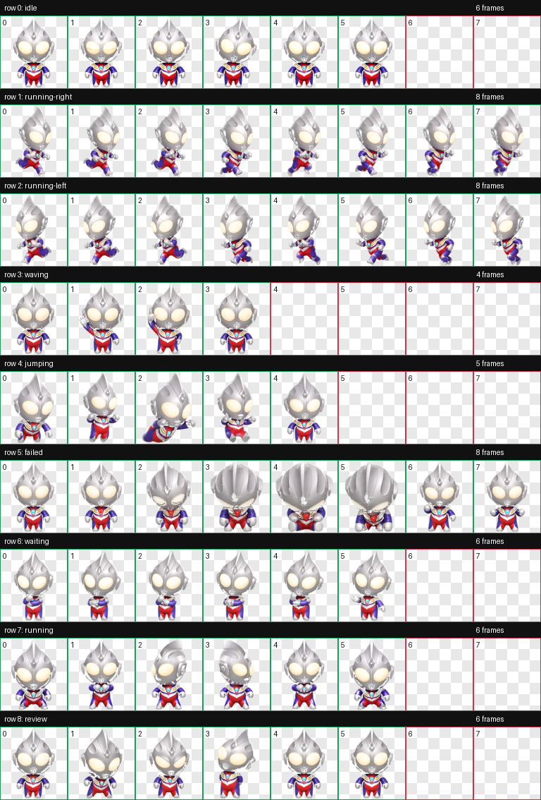
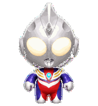
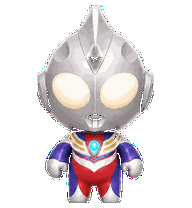

# Tiga / 迪迦 Codex Pet

An unofficial, fan-made animated Codex pet based on the supplied chibi Tiga reference. The pet uses Codex's native 8-column × 9-row custom-pet atlas format.



## Install

Copy these two files into a `tiga` directory under your Codex pets folder:

```text
~/.codex/pets/tiga/
├── pet.json
└── spritesheet.webp
```

If `CODEX_HOME` is configured, use `$CODEX_HOME/pets/tiga/` instead.

## Animation states

| Row | State | Frames | Tiga interpretation |
|---:|---|---:|---|
| 0 | `idle` | 6 | Breathing, subtle bob, and blink |
| 1 | `running-right` | 8 | Right-facing alternating gait |
| 2 | `running-left` | 8 | Left-facing alternating gait |
| 3 | `waving` | 4 | Restrained victory greeting |
| 4 | `jumping` | 5 | Takeoff, airborne pose, and landing |
| 5 | `failed` | 8 | Slump, cyan-to-red timer warning, recovery |
| 6 | `waiting` | 6 | Thinking, head tilt, and asking pose |
| 7 | `running` | 6 | Non-locomotion guard and focus cycle |
| 8 | `review` | 6 | Ready stance, inspection, confident finish |

## Previews

| Idle | Failed / timer warning |
|---|---|
|  |  |

All nine row previews are available in [`previews/`](previews/).

## Validation

- Atlas: `1536 × 1872`, RGBA WebP
- Cell size: `192 × 208`
- Frame inspection: 0 errors, 0 warnings
- Transparent RGB residue: 0 pixels
- Visible green-spill pixels after final decontamination: 0
- Independent visual QA: passed for identity, motion, direction, state semantics, and transparent edges

## Format boundary

Codex custom pets currently use a fixed nine-state atlas contract. Extra standalone states such as a beam attack, type transformation, punch/kick, or custom double-click handler are therefore not separately addressable in this package; their broader ready, charge, flight, success, thinking, and error cues are mapped into the supported rows above.

## Notice

This is an unofficial fan-made derivative asset provided for personal customization and is not affiliated with or endorsed by the relevant Tiga/Ultraman rights holders. No trademark or character-licensing rights are granted by this repository.

